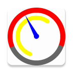

# GirTago
Android App for viewing sun and moon position during the 24 hours.
* Plottimg a circular image of sun and moon rise\set. 
* Easy to use. 
* Simple to see the moon state, day duration.

The red arc is the sun, yellow is the moon.
The app calculates the rise\set times by math algoritm without Internet. 

[The example on web](http://fxy.7ci.ru)